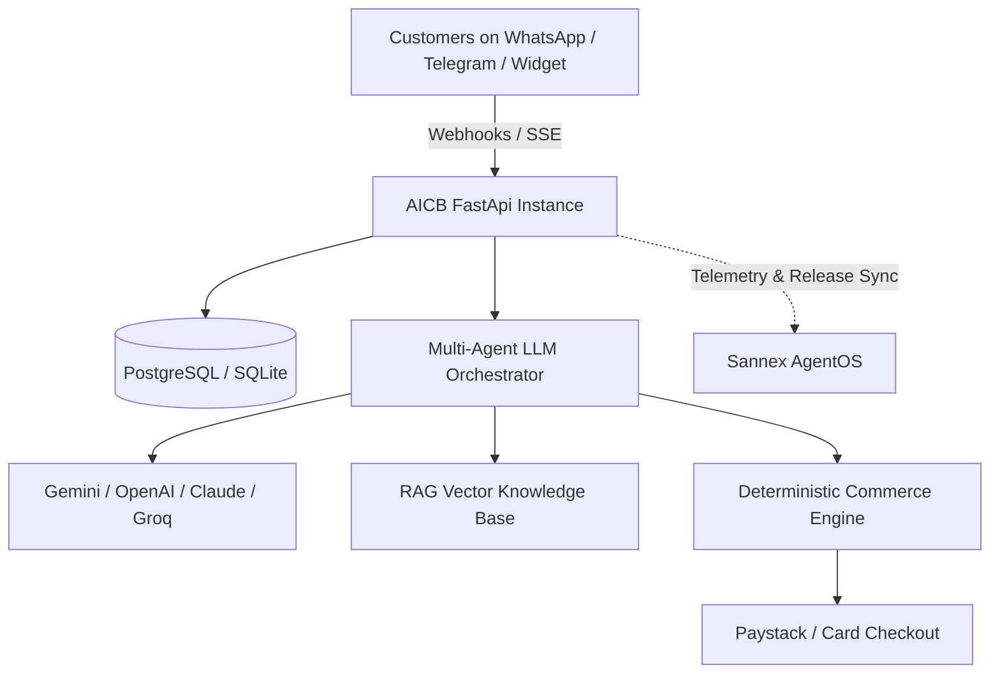

# Overview & Architecture

**AICB (AI Conversational Business Assistant)** is an open-source, autonomous AI Commerce engine and Multi-Agent Studio designed to automate customer service, product recommendations, catalog browsing, and instant checkout across messaging channels (WhatsApp, Telegram, and Website Widget).

**Sannex AgentOS** is the central orchestration and telemetry platform connecting AI agents, providing release syndication, performance analytics, and remote configuration.

---

## Core Pillars

### 1. 100% Self-Hosted & Zero Vendor Lock-in
Every AICB instance runs independently with its own database, vector search knowledge base, product catalog, and multi-channel webhook handlers. You can deploy it on Docker, Coolify, AWS, GCP, or a $5/mo VPS.

### 2. Strict Customer Data Privacy
Customer conversations, payment receipts, order logs, and database credentials remain **100% private to your self-hosted instance**. Telemetry sent to AgentOS is strictly fire-and-forget metadata without sensitive customer PII.

### 3. Multi-Agent Studio with Granular Scoping
Create multiple distinct assistant personas (e.g., *Sales Bot*, *VIP Support*, *Tech Specialist*), each with custom system prompts, LLM provider overrides, and **Access Groups** restricting what products and knowledge docs they can access.

### 4. Read-Only AgentOS Cloud Sync
AICB instances connect to AgentOS to receive real-time release notes, system health metrics, and documentation updates without granting write or command execution access to third parties.

---

## Architecture Components

| Component | Technology | Description |
|---|---|---|
| **Backend Engine** | Python 3.12 + FastAPI + SQLAlchemy | Async request routing, webhook verification, and flow processing |
| **Admin Dashboard** | Vanilla ES Modules + Custom CSS + Lucide | Fast, dependency-free SPA with Dark/Light modes and role-based access |
| **AI Orchestration** | LangChain-free Multi-Provider Engine | Dynamic model routing (Gemini 2.5 Flash, GPT-4o, Claude 3.5, Groq) |
| **Payment Gateway** | Paystack Standard API | Direct automated checkout link generation with webhook payment verification |
| **SDK** | `sannex-agent` (PyPI) & `@sannex/agent` (npm) | Dual-package parity telemetry client for external app integrations |
